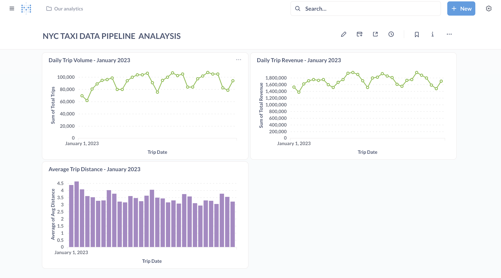
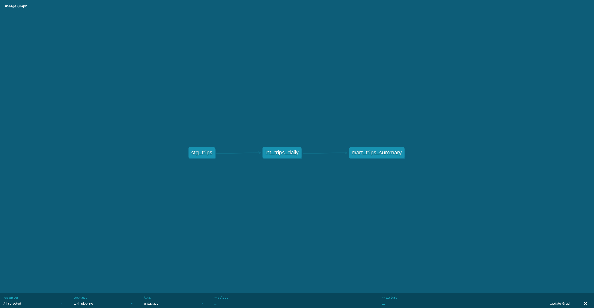

# NYC Taxi Data Pipeline 🚕

End-to-end ELT data engineering project processing 3M+ rows of NYC TLC Taxi Trip Data using modern data stack tools.

## Architecture

Raw Parquet File → AWS S3 → PostgreSQL → dbt Transforms → Metabase Dashboard

## Tech Stack

| Tool                       | Purpose                         |
| -------------------------- | ------------------------------- |
| Python, Pandas, SQLAlchemy | Data extraction and loading     |
| AWS S3                     | Raw data lake storage           |
| PostgreSQL                 | Local data warehouse            |
| dbt                        | Data transformation (ELT)       |
| Metabase                   | Business intelligence dashboard |

## Dashboard



## Pipeline Lineage



## dbt Models

| Layer        | Model              | Description                                          |
| ------------ | ------------------ | ---------------------------------------------------- |
| Staging      | stg_trips          | Cleans raw data, filters zero fares and invalid rows |
| Intermediate | int_trips_daily    | Aggregates 3M rows into daily metrics                |
| Mart         | mart_trips_summary | Final business metrics for dashboard                 |

## Data Quality Tests

15 dbt tests across all 3 layers — all passing ✅

| Test Type | Columns Tested                                                                                                                                                 |
| --------- | -------------------------------------------------------------------------------------------------------------------------------------------------------------- |
| not_null  | vendor_id, pickup_datetime, fare_amount, trip_distance, passenger_count, trip_date, total_trips, total_revenue, avg_distance, revenue_per_trip, tip_percentage |
| unique    | trip_date (intermediate + mart layers)                                                                                                                         |

## Key Insights from Dashboard

- 📈 **Daily trips:** 60,000–105,000 trips per day in January 2023
- 💰 **Daily revenue:** $1.4M–$1.9M per day
- 🗺️ **Average distance:** ~3.5 miles per trip
- 📅 **Weekly pattern:** Clear dips on weekends, peaks on weekdays

## Project Structure

```
nyc-taxi-data-pipeline/
├── screenshots/
│   ├── dashboard.png
│   └── lineageGraph.png
└── de-project/
    ├── load_data.py
    └── taxi_pipeline/
        └── models/
            ├── staging/
            │   ├── stg_trips.sql
            │   └── schema.yml
            ├── intermediate/
            │   ├── int_trips_daily.sql
            │   └── schema.yml
            └── mart/
                ├── mart_trips_summary.sql
                └── schema.yml
```

## Prerequisites

- Python 3.9+
- PostgreSQL installed and running
- AWS account with S3 bucket configured
- NYC TLC dataset downloaded locally

## How to Run

## How to Run

**1. Install dependencies:**

```bash
pip3 install pandas pyarrow psycopg2-binary sqlalchemy dbt-postgres
```

**2. Load raw data into PostgreSQL:**

```bash
python3 de-project/load_data.py
```

**3. Run dbt transformations:**

```bash
cd de-project/taxi_pipeline
dbt run
```

**4. Run data quality tests:**

```bash
dbt test
```

**5. Generate documentation:**

```bash
dbt docs generate && dbt docs serve
```

## What I Learned

- Designed a **3-layer ELT pipeline** (staging → intermediate → mart)
- Used **dbt ref()** for dependency management and environment-agnostic table references
- Applied **data quality testing** to catch bad data before it reaches the dashboard
- Understood **idempotency** — pipeline can be re-run anytime from S3 source of truth
- Built **cloud-agnostic architecture** — PostgreSQL locally, designed to swap Redshift in production
